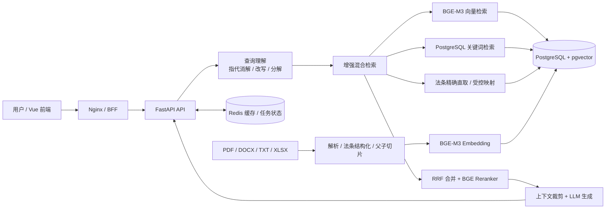

# Industrial RAG：中文法律知识库问答系统

[](https://github.com/pcwl22/RAG/actions/workflows/ci.yml)
[](https://www.python.org/)
[](https://fastapi.tiangolo.com/)
[](https://vuejs.org/)
[](https://github.com/pgvector/pgvector)
[](https://github.com/vibrantlabsai/ragas)

Industrial RAG 是一个面向中文法律文本的本地知识库问答项目。系统以 PostgreSQL + pgvector 为统一存储，结合 BGE-M3 向量检索、关键词检索、RRF 融合、交叉编码器重排、查询理解和受控法条映射，为回答提供可追溯的法条依据。

项目包含 FastAPI 后端、Vue 3 前端、文档摄入流水线、流式问答、Redis 缓存、CUDA 推理支持，以及基于 Ragas/LRAGE 的可复现质量评估体系。

> 本项目用于知识检索和技术验证，不构成法律意见。正式业务使用时，应由具备资质的专业人员复核法律依据、法规时效和个案事实。

## 发布质量状态

截至 2026-09-20，发布质量门禁已解除，当前实现已批准为生产基线。真实 PostgreSQL +
Embedding + Reranker 的 240 条完整检索评估 citation recall@5 为 0.9909，对抗集和比较集均为
1.0000，无答案拒答率为 1.0000；150 条独立保留集 citation recall@5 为 0.9867、MRR@5 为
0.9383。使用 `deepseek-flash` 官方端点完成的 40 条代表性正式裁判评估中，answer accuracy 为
0.7500、faithfulness 为 0.8417、上下文精度为 0.9944、上下文召回为 0.9239，全部达到发布阈值。

`validate_evaluation_assets.py` 会拒绝引用泄漏；`validate_release_baseline.py` 已通过 3 个受保护
数据集、12 项质量检查和实现指纹校验。批准基线绑定本次评测使用的模型及端点身份；运行时仍可
通过 `.env` 切换模型、API Key 和 URL，但身份改变后必须重新执行受保护评测并批准新基线。

测试数量、覆盖率和质量门禁结果由 CI 实时生成，不在 README 中维护容易过期的数字。

## 主要功能

- 中文法律文档解析，支持 PDF、DOCX、TXT、XLSX 等格式。
- 按法、编、章、节、条提取结构化元数据和稳定法条 ID。
- 父子块切分，检索使用精细子块，生成时可使用更完整父级上下文。
- BGE-M3 稠密检索与 PostgreSQL 关键词检索。
- Reciprocal Rank Fusion（RRF）融合和 BGE Reranker 重排。
- 查询指代消解、问题改写、复杂问题分解和多查询合并。
- 明确“法名 + 条号”时从 PostgreSQL 精确取回指定法条。
- 受控法律概念映射，提升多法条问题召回率。
- 对知识库范围外的问题返回无依据/拒答结果，避免强行生成法条。
- 非流式和 SSE 流式问答。
- 文档上传、处理状态、文档列表、切片检查和删除接口。
- Redis 答案缓存、语料版本失效和任务状态持久化。
- API Key 鉴权、CORS 校验、健康检查和 Prometheus 指标。
- Vue 3 管理界面，展示查询理解、检索上下文和处理轨迹。
- Ragas 0.4.3、LRAGE、精确 Citation Recall/MRR 和自动质量门禁。

## 系统架构



### 查询路径

1. API 校验问题长度、历史消息和检索参数。
2. 查询理解模块进行指代消解、改写和必要的问题分解。
3. 系统并行执行向量检索、关键词检索和受控法条召回。
4. 多路结果通过 RRF 合并，并使用交叉编码器针对原问题统一重排。
5. 若用户明确指定法名和条号，系统保留精确命中的法条并移除模糊邻居。
6. 最终上下文交给 LLM，答案附带实际检索到的依据。

### 文档摄入路径

1. 上传文件以流式方式写入临时目录，并检查扩展名和大小。
2. 文档解析器提取正文；法律文档进一步识别法条层级。
3. 普通文档使用父子块策略，结构化法律文本优先按条切分。
4. BGE-M3 生成向量，正文、向量和元数据写入 PostgreSQL。
5. 摄入成功后更新 Redis 语料版本，使旧答案缓存自动失效。
6. 失败文件进入受限隔离目录，默认保留 7 天且最多保留 100 个文件。

## 仓库结构

```text
RAG/
├── industrial-rag/              # FastAPI 后端与评估工具
│   ├── app/
│   │   ├── api/                 # 查询、聊天、上传接口
│   │   ├── embedding/           # BGE-M3 向量化
│   │   ├── evaluation/          # Ragas/LRAGE 适配与质量门禁
│   │   ├── parser/              # 文档解析、法律解析和切片
│   │   ├── retrieval/           # 稠密/混合检索、映射、重排
│   │   ├── service/             # 摄入、聊天和增强查询业务层
│   │   ├── vectorstore/         # PostgreSQL/pgvector 存储
│   │   └── workers/             # Celery 后台任务
│   ├── config/                  # laptop/base 配置
│   ├── docs/                    # Ragas 与 LRAGE 专项文档
│   ├── eval/                    # 可复现评估集
│   ├── prompts/                 # 系统、业务、输出和引用提示词
│   ├── scripts/                 # 安装、摄入、评估和诊断脚本
│   └── tests/                   # 后端自动化测试
├── rag-frontend/                # Vue 3 + Vite 前端
├── date/                        # 示例法律文档与官方摘录
├── models/                      # 本地模型目录（Git 忽略）
├── docker-compose.yml           # 统一本地部署入口
└── .github/workflows/ci.yml     # GitHub Actions
```

## 环境要求

### 推荐开发环境

- Windows 10/11
- PowerShell 7
- Python 3.12
- Conda/Miniconda
- Node.js 22
- Docker Desktop + Docker Compose v2
- NVIDIA GPU（推荐 8 GB 显存；CPU 也可运行但速度较慢）

当前验证环境使用：

- NVIDIA GeForce RTX 4060 Laptop GPU
- PyTorch `2.4.0+cu121`
- CUDA wheel 版本 `12.1`
- `transformers==4.44.2`
- `sentence-transformers==3.0.1`
- Ragas `0.4.3`

### 默认端口

| 服务 | 主机端口 | 说明 |
|---|---:|---|
| FastAPI（主机开发模式） | 8000 | `uvicorn app.main:app` |
| FastAPI（Compose API profile） | 18000 | 避免与其他本地 API 冲突 |
| Vue 开发服务器 | 5173 | Vite 开发或容器前端 |
| PostgreSQL/pgvector | 15432 | 容器内部为 5432 |
| Redis | 16379 | 容器内部为 6379 |

## 快速开始：Windows + 本机 GPU

### 1. 克隆仓库

```powershell
git clone https://github.com/pcwl22/RAG.git
Set-Location RAG
```

### 2. 配置环境变量

```powershell
Copy-Item industrial-rag\.env.example industrial-rag\.env
```

编辑 `industrial-rag/.env`，至少设置：

```dotenv
RAG_ENV=laptop
RAG_SERVICE_TENANT_ID=00000000-0000-0000-0000-000000000001
RAG_SERVICE_ROLES=viewer
POSTGRES_PASSWORD=replace-with-a-strong-password
POSTGRES_RUNTIME_USER=rag_runtime
POSTGRES_APP_PASSWORD=replace-with-a-different-strong-password
REDIS_PASSWORD=replace-with-a-third-strong-password
REDIS_URL=redis://:replace-with-a-third-strong-password@localhost:16379/0
COMPOSE_REDIS_URL=redis://:replace-with-a-third-strong-password@redis:6379/0
DEEPSEEK_API_KEY=replace-with-your-key
DEEPSEEK_API_URL=https://api.deepseek.com/v1
DEEPSEEK_MODEL=deepseek-chat
```

也可以切换到 Claude 或智谱，具体 provider 在 `industrial-rag/config/laptop.yaml` 中配置。

如需切换 OpenAI-compatible 网关、模型或密钥，可在 `industrial-rag` 目录执行原子切换命令。密钥通过隐藏输入读取，不会出现在命令行、日志或命令输出中；只切换 URL/model 时会保留现有密钥：

```powershell
python scripts\switch_llm_env.py --env-file .env --api-url https://api.deepseek.com/v1 --model deepseek-chat --prompt-api-key
python scripts\switch_llm_env.py --env-file .env --api-url https://gateway.example.com/v1 --model approved-model
```

如果同一 `.env` 中按空行保存了多组完整配置，并用 `#` 注释备用组，可在不回显密钥的情况下列出并激活指定组。一个组包含多个模型时必须用 `--profile-model` 明确选择：

```powershell
python scripts\switch_llm_env.py --env-file .env --list-profiles
python scripts\switch_llm_env.py --env-file .env --activate-profile 3
python scripts\switch_llm_env.py --env-file .env --activate-profile 1 --profile-model approved-model
```

切换会在写入前校验全部新值，并以同目录临时文件原子替换 `.env`；重复变量、带凭据或查询参数的 URL、非本机 HTTP 地址会被拒绝。应用和评测进程在启动时读取配置，因此切换后需重启相应进程/容器。发布评测报告仍绑定 URL 的非敏感哈希与模型名，切换后不能沿用旧 checkpoint 或审批结果。

> 不要提交 `.env`。仓库只跟踪不含真实凭据的 `.env.example`。

### 3. 启动 PostgreSQL 和 Redis

```powershell
docker compose --env-file industrial-rag\.env up -d postgres redis
docker compose --env-file industrial-rag\.env ps
```

等待两个服务显示 `healthy`。

### 4. 准备 Python/CUDA 环境

项目提供经过验证的 CUDA 安装脚本：

```powershell
Set-Location industrial-rag
pwsh -File scripts\setup_gpu_env.ps1 -EnvironmentName industrial-rag
```

脚本会先从 PyTorch CUDA 12.6 专用索引安装经过 SHA-256 校验的 PyTorch，
再安装完整哈希锁、以 `--no-deps` 安装项目元数据，并运行 `pip check` 与 CUDA smoke test。

如果环境已经创建，可以单独检查：

```powershell
conda run -n industrial-rag python scripts\check_cuda.py
```

### 5. 放置本地模型

默认 `laptop` 配置期望以下目录：

```text
E:\RAG\models\
├── bge-m3\
└── bge-reranker-v2-m3\
```

如果仓库不在 `E:\RAG`，请修改 `industrial-rag/config/laptop.yaml` 中的 `embedding.model_path` 和 `reranker.model_path`。

### 6. 启动 API

从仓库根目录运行：

```powershell
Set-Location .\industrial-rag
conda activate industrial-rag
python -m uvicorn app.main:app --host 127.0.0.1 --port 8000
```

验证服务：

```powershell
Invoke-RestMethod http://127.0.0.1:8000/health
Invoke-RestMethod http://127.0.0.1:8000/health/ready
```

API 文档：<http://127.0.0.1:8000/docs>

### 7. 启动前端

在仓库根目录打开另一个 PowerShell：

```powershell
Set-Location .\rag-frontend
npm install
npm run dev
```

访问 <http://127.0.0.1:5173>。

开发模式下 Vite 将 `/api` 和 `/health` 代理到后端。未配置
`VITE_OIDC_ISSUER`/`VITE_OIDC_CLIENT_ID` 时保持本地免登录模式；配置后前端自动使用
Authorization Code + PKCE 登录，并为 API 请求附加 Bearer access token。永久 API Key
绝不能放进 `VITE_*` 环境变量。

### 8. 启用 Keycloak OIDC 与多租户

仓库内置 Keycloak `identity` profile 和 `industrial-rag` Realm。后端只依赖标准
OIDC/JWT，因此也可以替换为 Entra ID、Okta 或 Authentik。

先在 `industrial-rag/.env` 增加以下非示例值；管理员密码必须自行生成：

```dotenv
KEYCLOAK_ADMIN=admin
KEYCLOAK_ADMIN_PASSWORD=replace-with-a-strong-admin-password
OIDC_ENABLED=true
COMPOSE_OIDC_ENABLED=true
OIDC_ISSUER=http://localhost:18080/realms/industrial-rag
OIDC_AUDIENCE=rag-api
OIDC_JWKS_URL=http://localhost:18080/realms/industrial-rag/protocol/openid-connect/certs
OIDC_INTERNAL_JWKS_URL=http://keycloak:8080/realms/industrial-rag/protocol/openid-connect/certs
VITE_OIDC_ISSUER=http://localhost:18080/realms/industrial-rag
VITE_OIDC_CLIENT_ID=rag-frontend
VITE_OIDC_AUDIENCE=rag-api
OIDC_CONNECT_SRC=http://localhost:18080
```

启动身份、API 和前端：

```powershell
docker compose --env-file industrial-rag\.env `
  --profile identity `
  --profile api `
  --profile frontend `
  up -d --build
```

打开 <http://localhost:18080/admin/>，切换到 `industrial-rag` Realm 后创建用户：

1. 在用户 Attributes 中设置 `tenant_id`，值必须是已登记的 UUID；默认租户为
   `00000000-0000-0000-0000-000000000001`。
2. 在 Role mapping 中至少分配 `viewer`；允许上传时分配 `editor`，允许删除时分配
   `admin`。
3. 设置非临时密码，然后访问 <http://localhost:5173> 完成 PKCE 登录。

新增租户时，先登记数据库租户，再把同一个 UUID 写入对应 Keycloak 用户属性：

```powershell
Set-Location industrial-rag
python scripts\provision_tenant.py `
  --tenant-id 11111111-1111-1111-1111-111111111111 `
  --name "示例租户"
```

现有语料在 schema v1→v3 首次迁移时自动回填到默认租户。数据库访问同时使用应用层
`tenant_id` 条件和 PostgreSQL RLS；文档摄入、Celery 任务状态、答案缓存与知识库版本
也都按租户隔离。API Key 仅用于服务调用，并映射到
`RAG_SERVICE_TENANT_ID`/`RAG_SERVICE_ROLES`。服务账号默认只有 `viewer`；自动上传任务
需要显式设置 `RAG_SERVICE_ROLES=viewer,editor`，删除任务才应授予 `admin`。

## 可选：使用 Docker Compose 启动完整服务

Docker API 和 worker 镜像默认使用 PyMuPDF 解析 PDF，不安装 MinerU。MinerU 的
Torch/Transformers 版本矩阵与主运行时不同；如需 OCR、公式或复杂表格解析，请在
独立 Python 环境或独立解析服务中安装 `industrial-rag[mineru]`，不要将该 extra
与 `constraints-docker.txt` 一起安装。

Compose 默认只将前端、API、PostgreSQL 和 Redis 绑定到 `127.0.0.1`。只有在明确
需要局域网访问并已配置防火墙、强密钥和数据库访问控制时，才应在 `.env` 中设置
`RAG_BIND_ADDRESS=0.0.0.0`。

API、前端和 Celery worker 通过 profile 提供，PostgreSQL/Redis 默认启动。启用
`api` 或 `frontend` profile 时，本地 Keycloak 与 Realm 配置任务也会自动启动，保证
OIDC 前后端配置一致。主 `docker-compose.yml` 是可移植的 CPU 配置：

启用 `api`/`worker` profile 时，Compose 会先运行一次性 `migrate` 服务。迁移服务使用
`POSTGRES_PASSWORD` 完成 DDL，并创建或轮换 `rag_runtime`；API 和 worker 只使用
`POSTGRES_APP_PASSWORD` 对应的非所有者账号。两个密码必须不同。

本地 Compose 会在 `postgres_tls` 命名卷中生成仅用于该栈的自签 PostgreSQL 证书，
API、worker 和迁移任务统一以 `sslmode=verify-full` 校验 `postgres` 主机名。该证书只用于
本机容器化验收；生产 Kustomize 部署仍必须挂载组织签发的 CA 与服务端证书，不能复用本地卷。

```powershell
docker compose --env-file industrial-rag\.env `
  --profile api `
  --profile frontend `
  up -d --build
```

使用 NVIDIA GPU 时叠加 GPU 覆盖文件：

```powershell
docker compose `
  -f docker-compose.yml `
  -f docker-compose.gpu.yml `
  --env-file industrial-rag\.env `
  --profile api `
  --profile frontend `
  up -d --build
```

生产 Compose 必须在 `.env` 中明确设置 `QUEUE_PROVIDER=celery`；启用 `api` profile 时会
一并启动 worker。`industrial-rag/.env.example` 保留 `memory` 仅用于本机直接运行 API。

```powershell
docker compose --env-file industrial-rag\.env `
  --profile api `
  --profile frontend `
  up -d --build
```

访问：

- 前端：<http://127.0.0.1:5173>
- API：<http://127.0.0.1:18000>
- API 文档：<http://127.0.0.1:18000/docs>

API 镜像基于固定 digest 的官方 PyTorch 2.13.0 + CUDA 12.6 runtime，但主 Compose
默认以 CPU 运行；GPU 覆盖文件才申请 NVIDIA 设备。worker 使用独立固定 digest 的
Python 3.12 基础镜像和 CPU Torch 载体，避免在单张显卡上重复加载模型。模型目录以
只读方式挂载到 `/app/models`。如果只运行前端容器并把 API
运行在主机，请设置：

首次构建需要拉取较大的官方 PyTorch runtime 基础镜像。

```dotenv
RAG_API_UPSTREAM=http://host.docker.internal:8000
```

## 摄入文档

### 通过 API 上传

默认 `laptop` 配置仅监听 `127.0.0.1` 且关闭 API Key/OIDC，使用本地管理身份，
因此下面的主机直连示例不需要认证头。`base`/Compose 模式启用 API Key 或 OIDC；
此时自动化调用应按已配置的认证方式附加凭据。

PowerShell 7 示例：

```powershell
$form = @{
  file = Get-Item "E:\documents\example.docx"
  partition = "legal"
  metadata = '{"source":"manual-upload","authority":"official"}'
}

Invoke-RestMethod `
  -Uri "http://127.0.0.1:8000/api/v1/documents/ingest" `
  -Method Post `
  -Form $form
```

返回结果包含 `task_id`。检查处理状态：

```powershell
Invoke-RestMethod `
  -Uri "http://127.0.0.1:8000/api/v1/documents/status/<task_id>" `
  -Headers $headers
```

### 摄入配套评估法规

仓库包含《劳动合同法实施条例》官方摘录验证脚本：

```powershell
Set-Location industrial-rag
conda run -n industrial-rag python scripts\ingest_evaluation_sources.py
```

脚本会先验证结构化法条 ID，再摄入 PostgreSQL；重复运行默认不会重复摄入。

### 幂等重处理已上传文档

重处理脚本复用正式摄入链路，并通过来源键替换同一租户中的旧版本。租户 UUID 为必填项，
避免把本地上传目录误写入默认租户：

```powershell
Set-Location industrial-rag
conda run -n industrial-rag python scripts\reprocess_documents.py `
  --tenant-id 00000000-0000-0000-0000-000000000001 `
  --upload-dir data\uploads `
  --pattern "*.pdf"
```

只读服务账号不能调用上传 API；脚本直接运行时仍应使用目标租户对应的受控运维身份和数据库凭据。

## API 概览

除根路径和健康检查外，启用鉴权时 API、OpenAPI 文档及运维端点都需要认证。API Key
服务调用使用：

```http
X-API-Key: <RAG_API_KEY>
```

| 方法 | 路径 | 说明 |
|---|---|---|
| `GET` | `/` | 服务信息 |
| `GET` | `/health` | 综合健康状态 |
| `GET` | `/health/live` | 存活检查 |
| `GET` | `/health/ready` | 就绪检查；未就绪返回 503 |
| `POST` | `/api/v1/query` | 只检索文档 |
| `POST` | `/api/v1/answer` | 检索并生成答案，可启用 SSE |
| `POST` | `/api/v1/query/enhanced` | 查询理解、改写、分解、检索和生成 |
| `POST` | `/api/v1/chat` | 多轮聊天；RAG 模式走增强查询服务 |
| `POST` | `/api/v1/chat/stream` | SSE 流式聊天 |
| `POST` | `/api/v1/documents/ingest` | 上传并摄入文档 |
| `GET` | `/api/v1/documents/status/{task_id}` | 查询摄入任务状态 |
| `GET` | `/api/v1/documents` | 列出知识库文档 |
| `GET` | `/api/v1/documents/{document_id}/chunks` | 检查实际入库切片 |
| `DELETE` | `/api/v1/documents/{document_id}` | 删除文档并失效缓存 |

### 增强查询示例

```powershell
$headers = @{
  "X-API-Key" = "your-rag-api-key"
  "Content-Type" = "application/json"
}

$body = @{
  query = "盗窃罪与职务侵占罪的核心区别是什么？"
  top_k = 5
  enable_rerank = $true
  enable_coreference = $true
  enable_decomposition = $true
  enable_rewrite = $true
} | ConvertTo-Json

Invoke-RestMethod `
  -Uri "http://127.0.0.1:8000/api/v1/query/enhanced" `
  -Method Post `
  -Headers $headers `
  -Body $body
```

### 仅检索示例

```json
{
  "query": "受胁迫参加犯罪的胁从犯如何处罚？",
  "top_k": 5,
  "similarity_threshold": 0.05,
  "enable_rerank": true,
  "partition": null
}
```

## 配置说明

配置加载顺序：

1. 加载 `industrial-rag/.env`。
2. 根据 `RAG_ENV` 读取 `industrial-rag/config/{RAG_ENV}.yaml`。
3. 将 YAML 中的 `${ENV_NAME}` 替换为环境变量。

主要配置：

- `RAG_ENV=laptop`：Windows 主机运行，数据库端口为 15432，模型路径为本地绝对路径。
- `RAG_ENV=base`：Docker/服务器运行，服务通过 Compose DNS 名连接，模型路径为 `/app/models`。
- `RAG_SECURE_MODE=true`：共享或生产环境的安全运行模式，强制 OIDC HTTPS 和 Redis TLS；仅本机回环验收可设为 `false`。
- `rag.retrieval.top_k`：默认最终上下文数量。
- `rag.retrieval.similarity_threshold`：首轮检索最低分。
- `reranker.score_threshold`：交叉编码器绝对相关性阈值。
- `reranker.failure_mode=closed`：重排模型不可用或推理失败时返回空上下文，避免绕过质量门禁；仅在接受降级召回风险时改为 `open`。
- `queue.provider`：`memory` 使用进程内后台任务；`celery` 使用外部队列。
- `security.api_key.enabled`：是否要求 `X-API-Key`。
- `security.cors`：允许访问 API 的浏览器来源。

配置文件：

- [`industrial-rag/config/laptop.yaml`](industrial-rag/config/laptop.yaml)
- [`industrial-rag/config/base.yaml`](industrial-rag/config/base.yaml)
- [`industrial-rag/.env.example`](industrial-rag/.env.example)

## 评估与质量门禁

### 评估数据

- `eval/legal_core.jsonl`：9 条核心法律回归样本。
- `eval/legal_expanded_240.jsonl`：240 条分层全量检索集，已通过引用泄漏检查。
- `eval/legal_expanded_ragas_40.jsonl`：40 条平衡 Ragas 代表集，已通过引用泄漏检查。
- `eval/legal_holdout_150.jsonl`：150 条事实情景 holdout 集，发布评估必须包含且通过泄漏检查。

扩展集由已筛查的事实情景 holdout 按固定种子重建，不从目标法条反向拼接问题：

```powershell
Set-Location industrial-rag
python scripts\build_expanded_eval.py `
  --output eval\legal_expanded_240.jsonl
python scripts\sample_eval_suite.py `
  --input eval\legal_expanded_240.jsonl `
  --output eval\legal_expanded_ragas_40.jsonl
```

重建后必须运行泄漏检查；任何未通过的数据都不能进入发布评估：

```powershell
python scripts\validate_evaluation_assets.py
```

### 全量本地检索评估

该步骤使用本地 PostgreSQL、Embedding 和 Reranker，不调用外部裁判模型：

```powershell
python scripts\evaluate_retrieval_suite.py `
  --input eval\legal_expanded_240.jsonl `
  --output data\ragas_eval\legal_expanded_240_retrieval.json `
  --top-k 5
```

检索评估通过生产同款 `build_retrieval_engine()` 工厂创建引擎，并在初始化数据库前拒绝
引用泄漏数据。发布还必须对 `eval/legal_holdout_150.jsonl` 执行同样的无泄漏校验。

### 导出增强 RAG 运行结果

```powershell
python scripts\export_lrage.py `
  --input eval\legal_expanded_ragas_40.jsonl `
  --output-dir data\lrage_exports `
  --task-name legal_expanded_ragas_40 `
  --top-k 5 `
  --enable-rerank
```

### 运行 Ragas 0.4.3

建议使用独立评估环境，避免与 GPU 推理环境的依赖发生冲突：

```powershell
pip install --require-hashes -r requirements-evaluation.lock.txt

python scripts\evaluate_ragas.py `
  --input data\lrage_exports\legal_expanded_ragas_40.jsonl `
  --output data\ragas_eval\legal_expanded_ragas_40.json `
  --max-tokens 8192
```

默认裁判从 `DEEPSEEK_MODEL` 读取，未配置时回退到 `deepseek-chat`。评估问题、答案和上下文会发送到配置的裁判端点；Ragas telemetry 在脚本中关闭。评测请求默认串行执行，并对限流/连接瞬态错误做有界重试；可用 `--max-concurrency`、`--max-retries` 和 `--retry-backoff-seconds` 调整，但发布门禁建议保持默认值。

### 质量门禁

```powershell
python scripts\check_quality_gate.py `
  --ragas-report data\ragas_eval\legal_expanded_ragas_40.json `
  --export data\lrage_exports\legal_expanded_ragas_40.jsonl `
  --output data\ragas_eval\legal_expanded_ragas_40_gate.json `
  --top-k 5

python scripts\check_expanded_quality_gate.py `
  --retrieval-report data\ragas_eval\legal_expanded_240_retrieval.json `
  --ragas-gate data\ragas_eval\legal_expanded_ragas_40_gate.json `
  --output data\ragas_eval\legal_expanded_release_gate.json
```

详细文档：

- [Ragas 评估](industrial-rag/docs/ragas_evaluation.md)
- [LRAGE 导出与运行](industrial-rag/docs/lrage_export.md)

## 测试与代码质量

### 后端

```powershell
Set-Location industrial-rag
python -m compileall -q app
python -m ruff check app scripts tests
python -m pytest tests -q
```

轻量 CI 环境：

```powershell
python -m pip install -r requirements-ci.txt
python -m pip install -e . --no-deps
```

### 前端

```powershell
Set-Location rag-frontend
npm install
npm test
npm run build
```

### Compose 配置

```powershell
# 在仓库根目录执行
docker compose --env-file industrial-rag\.env config
docker compose --env-file industrial-rag\.env --profile api --profile frontend config
```

GitHub Actions 会自动执行后端测试、Ruff、前端测试、前端构建和 Compose 配置检查。

### 生产配置预检

生产环境应由 Secret Manager、Kubernetes Secret 或同等级系统注入凭据。渲染部署环境后，
在启动服务前运行：

```powershell
Set-Location industrial-rag
python scripts\validate_production_env.py --env-file .env
```

该门禁要求非占位强密钥、独立的数据库管理员/运行时密码、Celery、`RAG_SECURE_MODE=true`、
OIDC HTTPS 和 `rediss://`。本地 Keycloak/Redis 验收可显式附加 `--allow-local-http`；
此参数不应用于生产。

### PostgreSQL 备份与恢复

备份脚本生成 PostgreSQL custom-format 归档，先写临时文件再原子发布。建议通过 `PGHOST`、
`PGPORT`、`PGDATABASE`、`PGUSER`、`PGPASSWORD` 注入受限备份账号：

```powershell
Set-Location industrial-rag
python scripts\backup_postgres.py --port 15432
```

恢复前先创建隔离的目标数据库并完成变更审批。脚本会先用 `pg_restore --list` 校验归档，
且确认值必须与目标数据库完全一致：

```powershell
python scripts\restore_postgres.py `
  --input data\backups\postgres\rag_db-20260730T000000Z.dump `
  --database rag_restore_test `
  --confirm-database rag_restore_test
```

覆盖已有对象还需显式增加 `--clean`。完整的 IdP、Secrets、HA、恢复演练和发布证据要求见
[生产部署清单](industrial-rag/deploy/production-checklist.md)。

## 安全说明

- `.env`、本地模型、数据库卷和运行评估报告已加入 `.gitignore`。
- API Key 使用恒定时间比较；OIDC access token 校验签名、issuer、audience、过期时间、
  必需的 `tenant_id` 和角色。健康检查保持公开，其他运维与 API 路径受认证保护。
- 前端使用 OIDC Authorization Code + PKCE，不包含或由 Nginx 注入永久管理员 API Key。
- 角色分为 `viewer`、`editor` 和 `admin`；上传需要 editor/admin，删除需要 admin。API Key
  服务账号默认仅有 viewer，额外权限必须通过 `RAG_SERVICE_ROLES` 显式授予。
- PostgreSQL 采用共享 schema 的 `tenant_id` 显式过滤与强制 RLS 双重隔离；Redis
  答案缓存、corpus version 和任务状态均使用租户命名空间。
- Keycloak `start-dev` profile 仅适用于本地和验收环境。生产环境应使用 TLS、外部
  HA PostgreSQL/Redis、生产 IdP、离站备份，并接入集中审计与密钥轮换。
- 生产模式下，如果启用了 API Key 却未配置安全值，应用会拒绝启动。
- 错误响应不会向客户端返回底层异常和数据库细节。
- 上传文件名会被规范化，metadata 必须是合法 JSON 对象，文件大小和格式均受限制。
- Celery 上传会先写入租户隔离的 S3 对象及服务端 manifest；任务消息只携带 `tenant_id` 和
  `object_key`，Worker 在自身临时目录下载，成功删除对象，处理失败转入失败保留前缀。

## 监控与健康检查

- `/health/live` 只表示进程存活。
- `/health/ready` 只有在 PostgreSQL、Embedding、LLM、启用的 Reranker，以及 Celery 模式所需的 Redis 就绪时才返回 200。
- `/health` 返回依赖状态，启动未完成时不会误报 healthy。
- 安装 `prometheus-fastapi-instrumentator` 且配置启用后，应用暴露 Prometheus 指标端点。

生产编排应使用 `/health/ready` 作为就绪探针，使用 `/health/live` 作为存活探针。

Prometheus 指标默认只在 `/internal/metrics` 暴露。生产环境应设置独立的
`RAG_METRICS_TOKEN`，并通过 `X-Metrics-Token` 请求头抓取；生产启动校验会拒绝缺失、
不足 32 字符、占位符或与 `RAG_API_KEY` 相同的指标 token。除通用 HTTP 指标外，系统还
暴露低基数的 `rag_llm_*`、`rag_embedding_*`、`rag_retrieval_*` 和 `rag_cache_*` 指标。
数据库 schema v3 的迁移历史记录在 `rag_schema_migrations`，迁移由一次性 `migrate`
服务执行，API/worker 不拥有 DDL 权限。新增迁移必须使用
`industrial-rag/app/vectorstore/migrations/versions` 下的不可变 SQL 文件，其 checksum
由规范化后的实际 SQL 内容计算。

发布基线不仅校验评估数据集，还绑定检索、分块、Prompt、Embedding、Reranker 和生成
实现的统一 SHA-256。修改这些路径后，`validate_release_baseline.py` 会失败，必须先通过
无泄漏的 240 条检索集、40 条 Ragas 代表集和 150 条 holdout 集评估，再批准新的实现指纹：

```powershell
python scripts\validate_evaluation_assets.py
python scripts\evaluate_retrieval_suite.py --input eval\legal_expanded_240.jsonl --output data\ragas_eval\legal_expanded_240_retrieval.json --top-k 5
python scripts\validate_release_baseline.py
python scripts\validate_release_baseline.py --print-implementation-sha256
```

## 常见问题

### PyTorch 未识别 CUDA

不要直接依赖默认 PyPI 自动选择 CUDA wheel。运行：

```powershell
pwsh -File industrial-rag\scripts\setup_gpu_env.ps1 -EnvironmentName industrial-rag
conda run -n industrial-rag python industrial-rag\scripts\check_cuda.py
```

确认输出包含 `torch_cuda_build: "12.6"` 和 `cuda_available: true`。

### PostgreSQL 连接失败

```powershell
docker compose --env-file industrial-rag\.env ps
docker compose --env-file industrial-rag\.env logs --tail 100 postgres
```

主机 `laptop` 配置连接 `localhost:15432`；容器 `base` 配置连接 `postgres:5432`，不要混用。

### Redis 不可用

`laptop` profile 中 Redis 是可选缓存，连接失败时会降级运行；`base` 生产 profile 会要求
带密码的 Redis URL，设置 `REDIS_REQUIRE_TLS=true` 或 `RAG_SECURE_MODE=true` 时还必须使用
`rediss://`。Celery 模式下
Redis 同时承担任务传输，故不可按可选依赖处理。生产 profile 的租户限流默认 fail-closed，
Redis 限流后端不可用时返回 503；仅 laptop profile 显式允许 fail-open。

### `/health/ready` 返回 503

检查响应中的 `dependencies` 字段。常见原因是 PostgreSQL 未健康、模型路径错误、模型文件不完整或内存/显存不足。

### 返回 401

启用 API Key 后，请求必须包含与 `RAG_API_KEY` 一致的 `X-API-Key`。浏览器前端应通过同源 Nginx/BFF 访问，避免把密钥暴露给客户端。

### 检索到了相似文本，但没有答案

Reranker 使用绝对相关性阈值，低于阈值时返回 0 条是合法结果。优先检查：

- 文档是否成功入库；
- `/documents/{document_id}/chunks` 中是否存在目标法条；
- 法条 metadata 中 `law_name`、`article_number` 和 `semantic_chunk_id` 是否正确；
- `similarity_threshold` 与 `reranker.score_threshold` 是否经过真实数据校准。

## 已知边界

- 当前受控映射和评估重点覆盖民法、刑法、劳动法；扩展到新部门法时应同步增加真实语料和回归集。
- 无答案识别依赖语料范围和检索证据，不能替代完备的法律领域分类器。
- API Key 适合单服务边界，不提供用户级授权。
- Ragas 指标受裁判模型和外部端点可用性影响，发布门禁同时保留确定性的 Citation Recall/MRR；裁判端点不可用时门禁必须失败关闭。
- 法律法规可能更新，生产知识库必须记录来源、版本、生效状态和废止状态。

## 参与开发

1. 从 `main` 创建功能分支。
2. 修改代码时同步添加或更新测试。
3. 提交前运行后端、前端和 Compose 验证。
4. 不提交 `.env`、API Key、模型权重、数据库文件和生成报告。
5. 通过 Pull Request 合并，确保 GitHub Actions 全部通过。

## 许可证

项目采用仓库根目录 `LICENSE` 中的 Apache License 2.0。引入或分发第三方法律文档、模型和依赖时，请同时遵守各自的许可、使用条款和数据来源要求。
